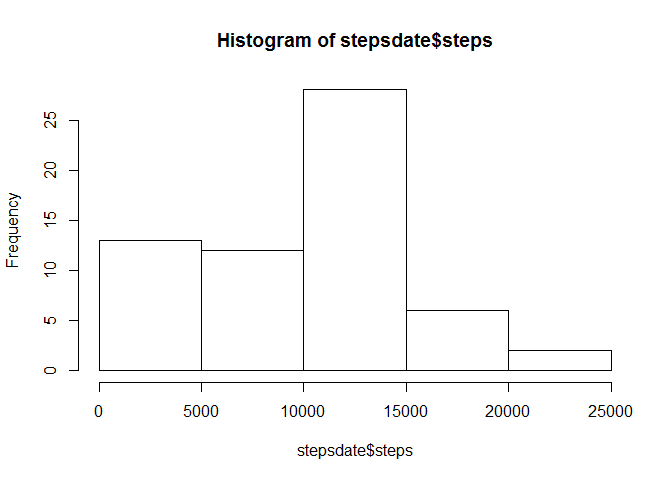
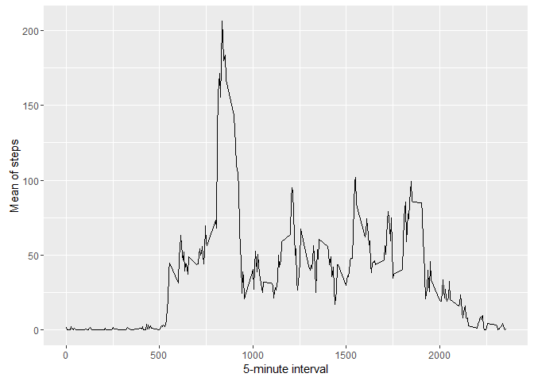
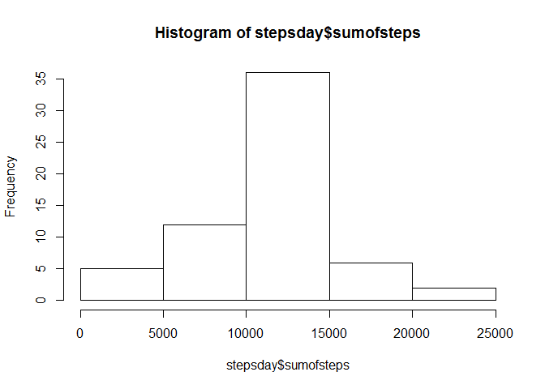
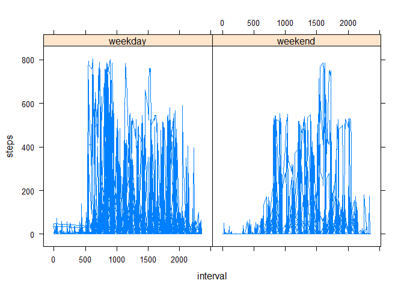

# Assignment: Course Project 1
Guilherme Louzada  
21 de maio de 2016  

#Load the data (i.e. read.csv())
Process/transform the data (if necessary) into a format suitable for your analysis


```r
activity <- read.csv("./data/activity.csv")
```

#Calculate the total number of steps taken per day

```r
library(dplyr)
```

```
## Warning: package 'dplyr' was built under R version 3.2.4
```

```
## 
## Attaching package: 'dplyr'
```

```
## The following objects are masked from 'package:stats':
## 
##     filter, lag
```

```
## The following objects are masked from 'package:base':
## 
##     intersect, setdiff, setequal, union
```

```r
z <- group_by(activity, date)
stepsdate <- summarise(z, steps=sum(as.integer(steps), na.rm=TRUE))
```

#Make a histogram of the total number of steps taken each day

```r
hist(stepsdate$steps)
```

<!-- -->

#Calculate and report the mean and median of the total number of steps taken per day


```r
mean(stepsdate$steps)
```

```
## [1] 9354.23
```

```r
median(stepsdate$steps)
```

```
## [1] 10395
```

#Time series plot (i.e. type = "l") of the 5-minute interval (x-axis) and the average number of steps taken, averaged across all days (y-axis)


```r
y <- group_by(activity, interval)
intval <- summarise(y, meanofsteps=mean(as.numeric(steps), na.rm=TRUE))
head(intval)
```

```
## Source: local data frame [6 x 2]
## 
##   interval meanofsteps
##      (int)       (dbl)
## 1        0   1.7169811
## 2        5   0.3396226
## 3       10   0.1320755
## 4       15   0.1509434
## 5       20   0.0754717
## 6       25   2.0943396
```

```r
library(ggplot2)
```

```
## Warning: package 'ggplot2' was built under R version 3.2.4
```

```r
ggplot(intval, aes(interval,meanofsteps)) + geom_line() +
  xlab("5-minute interval") + ylab("Mean of steps")
```

<!-- -->

#Which 5-minute interval, on average across all the days in the dataset, contains the maximum number of steps?


```r
intval[which.max(intval$meanofsteps),]$interval
```

```
## [1] 835
```

#Calculate and report the total number of missing values in the dataset (i.e. the total number of rows with NAs)


```r
NAs <- subset(activity, is.na(activity$steps)==TRUE)
count(NAs)
```

```
## Source: local data frame [1 x 1]
## 
##       n
##   (int)
## 1  2304
```

#Strategy for filling in all of the missing values in the dataset. 


```r
FilledDS <- activity
stepsfunc <- function(interval){
  intval[intval$interval==interval,]$meanofsteps
}

i=0
for(i in 1:nrow(FilledDS)){
  if(is.na(FilledDS[i,]$steps)){
    FilledDS[i,]$steps <- stepsfunc(FilledDS[i,]$interval)
  }
  i=i+1
}
head(FilledDS)
```

```
##       steps       date interval
## 1 1.7169811 2012-10-01        0
## 2 0.3396226 2012-10-01        5
## 3 0.1320755 2012-10-01       10
## 4 0.1509434 2012-10-01       15
## 5 0.0754717 2012-10-01       20
## 6 2.0943396 2012-10-01       25
```


#Histogram of the total number of steps taken each day and Calculate and report the mean and median total number of steps taken per day. 


```r
v <- group_by(FilledDS, date)
stepsday <- summarise(v, sumofsteps=sum(as.numeric(steps), na.rm=TRUE))
head(stepsday)
```

```
## Source: local data frame [6 x 2]
## 
##         date sumofsteps
##       (fctr)      (dbl)
## 1 2012-10-01   10766.19
## 2 2012-10-02     126.00
## 3 2012-10-03   11352.00
## 4 2012-10-04   12116.00
## 5 2012-10-05   13294.00
## 6 2012-10-06   15420.00
```

```r
hist(stepsday$sumofsteps)
```

<!-- -->

```r
mean(stepsday$sumofsteps, na.rm=TRUE)
```

```
## [1] 10766.19
```

```r
median(stepsday$sumofsteps, na.rm=TRUE)
```

```
## [1] 10766.19
```


#New factor variable in the dataset with two levels - "weekday" and "weekend" indicating whether a given date is a weekday or weekend day.


```r
FilledDS$date <- as.Date(FilledDS$date)
FilledDS$day=ifelse(as.POSIXlt(FilledDS$date)$wday%%6==0,"weekend","weekday")
FilledDS$day=factor(FilledDS$day,levels=c("weekday","weekend"))
head(FilledDS)
```

```
##       steps       date interval     day
## 1 1.7169811 2012-10-01        0 weekday
## 2 0.3396226 2012-10-01        5 weekday
## 3 0.1320755 2012-10-01       10 weekday
## 4 0.1509434 2012-10-01       15 weekday
## 5 0.0754717 2012-10-01       20 weekday
## 6 2.0943396 2012-10-01       25 weekday
```

#Panel plot containing a time series plot (i.e. type = "l") of the 5-minute interval (x-axis) and the average number of steps taken, averaged across all weekday days or weekend days (y-axis).


```r
library(lattice)
xyplot(steps~interval|factor(day),data=FilledDS,type="l")
```

<!-- -->

